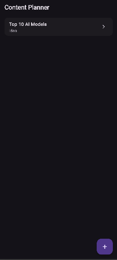
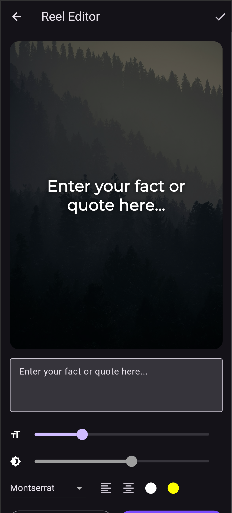
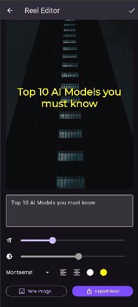

# 🎬 Faceless Reel Planner & Editor


A fully functional, cross-platform mobile application built with Flutter, designed to help content creators ideate, script, and generate aesthetic "faceless" video content for platforms like Instagram Reels, YouTube Shorts, and TikTok.

This project demonstrates clean architecture, local data persistence, REST API integration, and complex UI rendering.

## ✨ Features

- **Real-time Canvas Rendering:** Uses Flutter's `Stack` widget to overlay dynamic text onto images, providing a live preview of the final reel.
- **REST API Integration:** Connects to the Unsplash API to fetch high-quality, aesthetic background images on demand.
- **On-Device Export:** Utilizes the `screenshot` package to capture the widget tree at a high pixel ratio and native share sheets to export the final composition.
- **Robust State Management:** Implements `Provider` for clean, decoupled UI state updates without unnecessary widget rebuilds.
- **Zero-Latency Local Storage:** Uses `Hive` (a lightweight NoSQL database) to persist reel ideas, scripts, and workflow statuses offline.
- **Typography & Styling Control:** Integrated with Google Fonts, allowing users to dynamically adjust font families, sizes, alignment, and background opacity.

## 📱 Screenshots

| Dashboard                                             | Editor View                                           | Style Controls                                        |
| ----------------------------------------------------- | ----------------------------------------------------- | ----------------------------------------------------- |
|  |  |  |

## 🛠 Tech Stack & Packages

- **Framework:** Flutter / Dart
- **Architecture:** MVVM (Model-View-ViewModel)
- **State Management:** `provider`
- **Local Database:** `hive`, `hive_flutter`
- **Networking:** `http`, `cached_network_image`
- **Utilities:** `screenshot`, `path_provider`, `share_plus`, `google_fonts`

## 🏗 Architecture & Project Structure

The project is organized to ensure a clean separation of concerns, making it highly maintainable and scalable.

```text
lib/
 ┣ models/          # Hive objects and data structures (e.g., ReelIdea)
 ┣ services/        # External interactions (Unsplash API logic)
 ┣ viewmodels/      # Business logic and State (ReelProvider)
 ┣ views/           # UI Screens (Dashboard, Editor)
 ┗ main.dart        # Entry point and dependency injection
```
